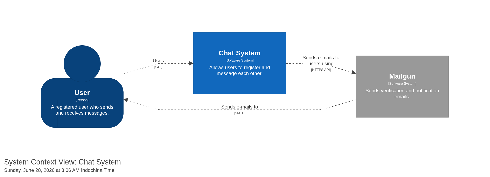
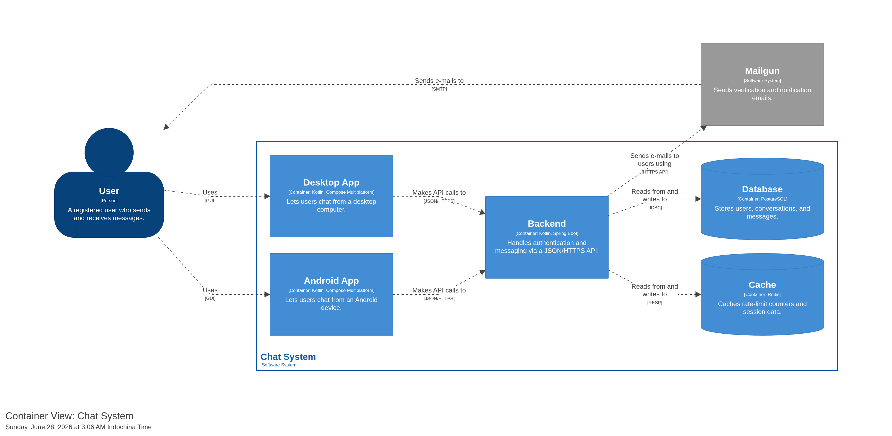

# NeroChat Backend

Backend API for Nero Chat — a simple chat application where users register an account and message each other.

**Tech stack:** Kotlin · Spring Boot · PostgreSQL (Supabase) · Redis (Redisson)

> **Status:** Actively under development.

## Architecture

Structurizr setup is only tested on Podman.

### System Context

### Containers

## Thanks to

**[Chirp API](https://github.com/philipplackner/chirp-api)** by Philipp Lackner for the dedicated KMP course
